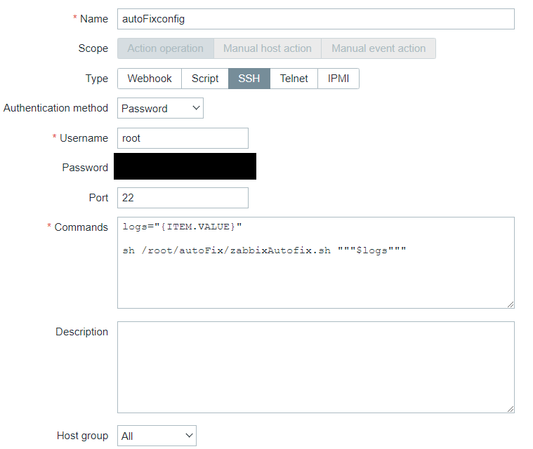
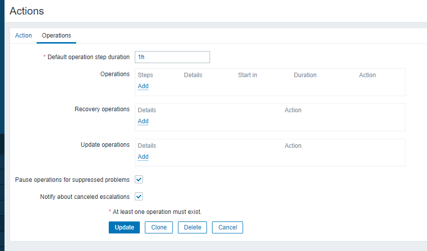

# Overview
This is script that fix configration file,when zabbix detects http error log.<br>
The script is runed from zabbix,and send error message to OPENAI for analyzing error log.<br>
OPENAI output configration file,parameter and value to fix error.<br>
The script fix configration file and send result of fix file to zabbix.<br>
You can check result of fix.


# Execution environment
### Zabbix Server
- Zabbix Server 6.0

### Monitored Server
- Zabbix Agent 6.0
- httpd
- python 3.11
- openai

# Zabbix environment settings

Refer to the following URL and build zabbix enviroment.

https://www.zabbix.com/download?zabbix=6.0&os_distribution=alma_linux&os_version=9&components=server_frontend_agent&db=mysql&ws=apache

Once zabbix is finished building, You have to regist host,script,action,item,and trigger on zabbix server.

### register the host.

[Configuraton]->[Hosts]


### register item that collecting http error log and zabbix trapper on the host

[Configuraton]->[Hosts]->["target hots"]->[Create Items]

■ setting of collecting http error log


■ setting of collecting zabbix trapper


### register the trigger 

■ setting of http error log trigger

[Configuraton]->[Hosts]->["target hots"]->[Create Triggers]


■ setting of zabbix trapper trigger


### register the script

[Administration]->[Scripts]->[Create Script]

When run script, zabbix server must connect to monitored server with ssh.
<br>Therefore, you must sets "ssh" on "type" item.
<br>And, you sets root on Username item.
On Commands item,use "items" value detected.
And run "zabbixAutofix.sh".



### register the action

[Configuraton]->[Actions]->[Trigger actions]->[Create Action]

To set execution conditions,set the following item.


Onece set execution conditions, click "Operatoins" tab.<br>



Click "Add" on "Operations" item,set Operation details.<br>
you need to select script that you registed script the previous step.<br>
you set monitored Host on "Target list" item.<br>


# Monitored Server environment settings

On the monitored server,Move "/root/" directory and run the below command.
```
dnf install python
pip install openai
git clone <url>
```

# Example

After raising http error, check error message on zabbix web console.


If you can check http error,click below item.<br>
[last data]-[zabbix trapper item]-[History]<br>

The below image is before value and after value.


